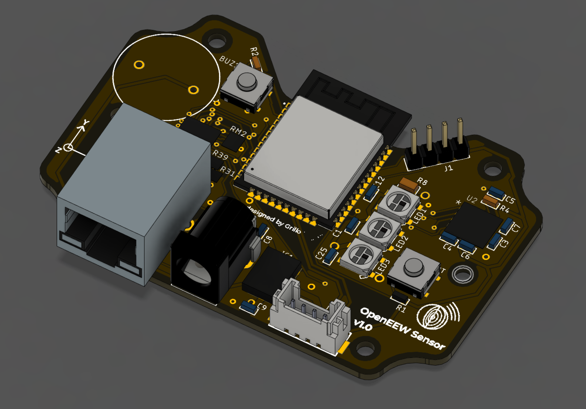

# OpenEEW Sensor
The OpenEEW sensor features a high performance MEMS accelerometer and ethernet or wifi connectivity. It includes also a loud buzzer and 3 bright Neopixel LEDS for alarm functions. By including alarm functions, the owners of the locations where they are installed are more likely to value and look after the device.

The OpenEEW sensor has already shown itself to be [as good as seismometers that cost 60x more](https://openeew.com/blog/sensor-benchmark).

## Hardware

Components are mounted in a PCB with the corresponding circuitry. The board operates at 3.3V with a maximum current of 1A. The accelerometer is accessed via SPI interface, specifically ESP32's VSPI. For this device we have selected the ADXL355 accelerometer for its low noise and relatively low cost.

GPS can optionally be added with a UART interface.

You can find here the [schematics](/eagle/openeew_sensor.pdf), PCB and BOM files. The board was generated using Autodesk Eagle software.

## Enclosure

You can [3d print yourself a sturdy wall mounted enclosure](/enclosure/) for your PCB using Fusion 360 or your favourite modelling program. This design features snap lip joints to make it easy to assemble, and flanged base for a sturdy connection to the wall surface.

_OpenEEW case design v1.0_

Alternatively you can buy a case that fits the board dimensions ([such as this](https://www.aliexpress.com/item/4000337012320.html?spm=a2g0o.detail.1000014.19.36fa34d16GPRAR&gps-id=pcDetailBottomMoreOtherSeller&scm=1007.14976.157518.0&scm_id=1007.14976.157518.0&scm-url=1007.14976.157518.0&pvid=d8255fa0-4728-41cd-be64-fe030910cf37&_t=gps-id:pcDetailBottomMoreOtherSeller,scm-url:1007.14976.157518.0,pvid:d8255fa0-4728-41cd-be64-fe030910cf37,tpp_buckets:668%230%23131923%2312_668%23808%236395%23432_668%23888%233325%233_4976%230%23157518%230_4976%232711%237538%23458_4976%233223%2310328%231_4976%233104%239653%235_4976%233141%239887%239_668%232846%238107%2326_668%232717%237564%23644_668%233164%239976%23121)).

## Firmware
This code allows an ESP32 device to send 3 axis acceleromter readings to a remote MQTT endpoint from its accelerometer to an MQTT endpoint. Optionally it also allows an attached NEO-6m GPS module to attach accurate time via the PPS signal (Pulse Per Second).

### Config.h
In the config.h file two levels of debugging can be set, first "debug" variable needs to be set true to allow serial communication and only basic status lines are part of the output. Second level is set by making LOG_L2 true, this would give specific output on the WiFi events.

The Sample rate needs to be defined by making true either of the 125Hz or 31.25Hz options. Device Id can be edited also, along with the udp port and destination IP.

### Operation
In the setup we check that the accelerometer is present, calibrate it and set the ODR, LPF and RANGE. After that, we wait for the GPS to have reception. Once location is acquired it is put into a location message. Finally the device reads the flash memory for saved networks and scans to see if they match any available. If there's a match, connect, if not, start smart config. If smart config is available and was successful, save the network.

For the loop, the device checks if still connected to WiFi, if not, retry connection. When a PPS signal is present, it interrupts the system, gets the timestamp and starts a micros timer.When the interrupt coming from the ADXL is present, meaning that FIFO is full, the system takes the timestamp, and attaches the micro seconds that passed since the PPS started, giving time accuracy. Then the device reads the FIFO values, puts them into a JSON message and sends them to the udpDestination and udpPort specified in the config file. Multiple FIFOS can be concatenated in a message, number of fifos in a message can be specified in the config file.

For tracking purposes the traces have a consecutive id, this is not intended for a production firmware, their purpose is to count how many traces are sent and received.

## Authors

- **Grillo** - _Initial work_ - [Grillo](https://grillo.io)

Enjoy! Give us [feedback](https://github.com/openeew/openeew-sensor/issues) if you have suggestions on how to improve this information.

## License

The OpenEEW sensor is licensed under the Apache Software License, Version 2. Separate third party code objects invoked within this code pattern are licensed by their respective providers pursuant to their own separate licenses. Contributions are subject to the [Developer Certificate of Origin, Version 1.1 (DCO)](https://developercertificate.org/) and the [Apache Software License, Version 2](http://www.apache.org/licenses/LICENSE-2.0.txt).
